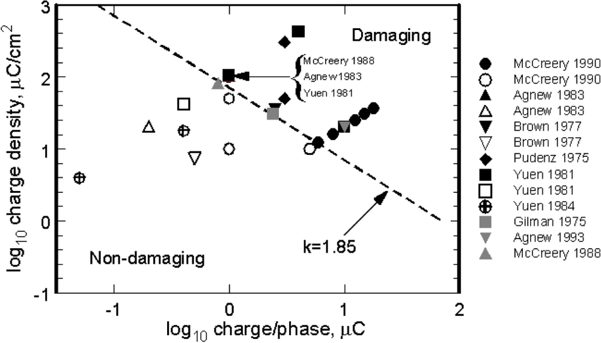

# Shannon Charge Safety Calculator

Python package and command-line tool to calculate electrical stimulation:

- **Charge per phase** in `uC/phase`
- **Charge density** in `uC/cm^2/phase`
- **Shannon k value** using `k = log10(Q) + log10(D)`

where `Q` is charge per phase in `uC/phase` and `D` is charge density in `uC/cm^2/phase`.

> Safety note: This tool is for research/engineering calculation support only. It does **not** determine clinical safety, device compliance, or regulatory acceptability. Always verify electrode geometry, waveform assumptions, manufacturer guidance, and protocol-specific limits.

## Install

```bash
git clone https://github.com/wustew2035/shannon-charge-safety.git
cd shannon-charge-safety
python -m pip install -e .
```


## Command-line usage

Required stimulation inputs:

- `--current-ma`: current in mA
- `--pulse-width-us`: pulse width in microseconds

You can enter electrode surface area in either of two ways.

### Option 1: cylinder diameter and height in mm

Use this when the exposed electrode surface is the lateral surface of a cylindrical contact:

```bash
shannon-charge-safety --current-ma 6 --pulse-width-us 60 --diameter-mm 0.8 --height-mm 1.5
```

This calculates area as:

```text
area_mm2 = pi * diameter_mm * height_mm
```

Example output:

```text
Charge safety calculation
-------------------------
Current:               6 mA
Pulse width:           60 us
Surface area:          3.76991 mm^2 (0.0376991 cm^2)
Charge per phase:      0.36 uC/phase
Charge density:        9.5493 uC/cm^2/phase
Shannon k:             0.536274
```

### Option 2: surface area as a single value in mm²

Use this when you already know the exposed electrode surface area:

```bash
shannon-charge-safety --current-ma 3 --pulse-width-us 60 --area-mm2 1.2
```

### JSON output

```bash
shannon-charge-safety --current-ma 3 --pulse-width-us 60 --area-mm2 1.2 --json
```

## Python usage

```python
from shannon_charge_safety import calculate_charge_safety

# Area input option 1: cylinder diameter and height in mm
result = calculate_charge_safety(
    current_mA=3,
    pulse_width_us=60,
    diameter_mm=0.8,
    height_mm=1.5,
)
print(result.charge_density_uC_per_cm2)
print(result.shannon_k)

# Area input option 2: surface area in mm^2
result = calculate_charge_safety(
    current_mA=3,
    pulse_width_us=60,
    area_mm2=1.2,
)
```

## Equations

### Charge per phase

```text
Q_uC = current_mA * pulse_width_us / 1000
```

### Area conversion

```text
area_cm2 = area_mm2 / 100
```

### Charge density

```text
D = Q_uC / area_cm2
```

### Shannon k value

```text
k = log10(Q_uC) + log10(D)
```

## Example: 0.8 mm diameter × 1.5 mm height cylindrical contact

```bash
shannon-charge-safety --current-ma 6 --pulse-width-us 60 --diameter-mm 0.8 --height-mm 1.5
```

This gives:

- Surface area: `3.77 mm^2 = 0.0377 cm^2`
- Charge per phase: `0.36 uC/phase`
- Charge density: approximately `9.55 uC/cm^2/phase`
- Shannon k: approximately `0.536`

## Important geometry caveat

For cylindrical ring contacts, `--diameter-mm` and `--height-mm` use the lateral cylindrical surface area: `pi × diameter_mm × height_mm`. This excludes the circular end caps. Use `--area-mm2` instead when you already know the manufacturer-specified exposed conductive surface area or when the contact geometry is segmented, rectangular, or otherwise non-cylindrical.

## Shannon k value safety



**Figure.** Exceeding a Shannon k value of 1.85 may cause neural tissue damage. Figure is from Cogan et al. 2017.

## Citations

- Cogan et al. Tissue damage thresholds during therapeutic electrical stimulation. Journal of Neural Engineering. 2016 Apr;13(2):021001. doi: 10.1088/1741-2560/13/2/021001.
- Shannon RV. A model of safe levels for electrical stimulation. IEEE Transactions on Biomedical Engineering. 1992 Apr;39(4):424-6. doi: 10.1109/10.126616.
- McCreery et al. Charge density and charge per phase as cofactors in neural injury induced by electrical stimulation. IEEE Transactions on Biomedical Engineering. 1990 Oct;37(10):996-1001. doi: 10.1109/10.102812.
- McCreery et al. Comparison of neural damage induced by electrical stimulation with faradaic and capacitor electrodes. Annals of Biomedical Engineering. 1988;16(5):463-81. doi: 10.1007/BF02368010.

## License

MIT
